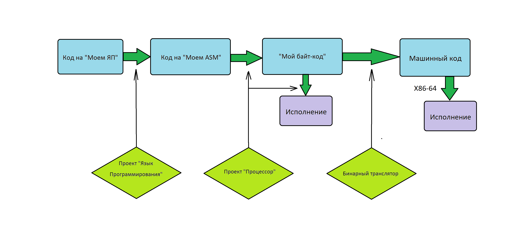

# Проект "Бинарный транслятор"
## Краткое описание проекта
Основной целью данного проекта является разработка бинарного транслятора для ранее созданного мной ["ассемблера"](https://github.com/MatveevDmtr/MyProcessor). Данный бинарный транслятор может выполнять функции (Just In Time)-компилятора. Подробную информацию о JIT-компиляторах можно прочитать [здесь](https://ru.wikipedia.org/wiki/JIT-%D0%BA%D0%BE%D0%BC%D0%BF%D0%B8%D0%BB%D1%8F%D1%86%D0%B8%D1%8F).

Данный программный продукт совместим с другими моими проектами: ["Язык Программирования"](https://github.com/MatveevDmtr/AUF_Language) и ["Процессор"](https://github.com/MatveevDmtr/MyProcessor).

Данная проектная работа является частью курса "Основы промышленного программирования" от [И.Р. Дединского](https://github.com/ded32) на Факультете Радиотехники и Компьютерных Технологий (ФРКТ) МФТИ. Задание носит обучающий характер.

## Технология JIT-компиляции
JIT-компиляция – это метод повышения производительности интерпретируемых программ. JIT расшифровывается как Just-in-time. Во время выполнения программа может быть скомпилирована в машинный код для повышения ее производительности. Также этот метод известен как динамическая компиляция.

Динамическая компиляция имеет несколько преимуществ перед статической. При запуске приложений на JAVA или C# среда выполнения может профилировать приложение во время его исполнения. Это позволяет создавать более оптимизированный код. Если поведение приложения меняется во время его исполнения, то среда выполнения может перекомпилировать код.

Есть некоторые недостатки, заключающиеся в задержках при запуске или непроизводительных издержках при компиляции во время выполнения.

Большинство реализаций JIT имеют последовательную структуру: сначала приложение компилируется в байт-код виртуальной машины среды исполнения (AOT-компиляция), а потом JIT компилирует байт-код непосредственно в машинный код. В итоге при запуске приложения тратится лишнее время, что впоследствии компенсируется более быстрой его работой. 

Ниже приведены некоторые примеры JIT-компиляторов:

1. Java: JVM (Java Virtual Machine – виртуальная машина Java)
2. C#: CLR (Common Language Runtime – общеязыковая исполняющая среда)
3. Android: DVM (Dalvik Virtual Machine – виртуальная машина Dalvik) или ART (Android RunTime – среда выполнения Android-приложений) в новых версиях

Источник: [merionet.ru](https://wiki.merionet.ru/servernye-resheniya/109/chto-takoe-jit-kompilyaciya/).

## Предыдущие проекты и их взаимосвязь с текущей задачей

В проекте ["Язык программирования"](https://github.com/MatveevDmtr/AUF_Language) была реализована трансляция кода на моем "АУФ-Языке Программирования" (далее - "Мой ЯП") в специфический, подобный ассемблеру язык (далее - "Мой ASM").

В проекте ["Процессор"](https://github.com/MatveevDmtr/MyProcessor) была написана [программа](https://github.com/MatveevDmtr/MyProcessor/tree/main/src/Assembler), транслирующая "Мой ASM" в специально разработанный байт-код (далее - "Мой байт-код"), который исполняется смоделированным на языке С [процессором](https://github.com/MatveevDmtr/MyProcessor/tree/main/src/cpu).

Схематично работу этих программ можно изобразить так:


## Описание задачи

В данном проекте решается следующая задача: необходимо "Мой байт-код" перевести в машинный код, а затем исполнить на процессоре компьютера. 

При этом время исполнения программ должно сильно уменьшиться (по сравнению с исполнением на моём виртуальном процессоре). 

Измерим, во сколько раз ускорится исполнение программ при применении JIT-компиляции.

## Инструменты и реализация

Для достижения поставленных целей будем использовать языки С и С++.
На вход программе даётся "Мой байт-код", записанный в `.txt` файл. Его необходимо распарсить, после чего сформировать _некоторый аналог_ IR (Intermediate Representation) - односвязный список ассемблерных команд. В моём случае при парсинге команды "Моего ASM" будут сразу транслироваться в команды NASM, и уже в таком виде заноситься в список.
Далее, заполнив все поля каждой ячейки списка, запишем все байт-коды команд (в машинном коде) в аллоцированный буфер. С помощью фунции `mprotect()` дадим этому буферу временные права на исполнение, и запустим оттранслиованный код.
С помощью модуля `<ctime>` будем засекать время, затрачиваемое исполнение этого кода.


Документации к вышеперечисленным функциям и библиотекам можно найти тут: [`ctime`](http://cppstudio.com/post/468/), [`mprotect`](https://www.opennet.ru/man.shtml?topic=mprotect&category=2&russian=0).

## Описание реализованных функций

Не считая кода, взятого из проекта ["Процессор"](https://github.com/MatveevDmtr/MyProcessor), бинарный транслятор можно условно разделить на 2 части:
1. Анализатор (Parser) - читает "Мой байт-код" из `.txt` файла и формирует _некоторый аналог_ Intermediate Representation (список, каждый элемент которого соответствует одной команде __nasm__).
2. Исполнитель (Executor) - проходится по списку IR и записывает коды команд __nasm__ в отдельный буфер. Затем этому буферу временно даются права на исполнение, и засекается время, за которое выполняется код из этого буфера.
   
Отдельно существует файл `main.cpp`, который запускает ["Процессор"](https://github.com/MatveevDmtr/MyProcessor) в комбинации с бинарным транслятором для удобства использования.

Для повышения читаемости кода в файле `Parser.cpp` используется __DSL__ (domain-specific lamguage), источником которого являются макросы `#define` из файла `DSL_for_parser.h`.

Также при помощи директив `#define` реализована кодогенерация в файле `Parser.cpp` из файла `BinTransCodeGen.h`, которая упрощает пополнение и редактирование системы команд "Моего ASM".

## Схема трансляции

Ниже приведена схема трансляции некоторых команд "Моего ASM" в команды __NASM__:

| Команда "Моего ASM" | Команды nasm        |
| ---------- | ---------------          |
| HLT          |      ret                   |
| PUSH [offset]|      push [r15+offset]     |
| PUSH reg     |      push reg              |
| PUSH val     |      mov rsi, val <br> push rdi          |
| POP [offset]|      pop [r15+offset]     |
| POP reg     |      pop reg              |
| ADD         |      pop rbx <br> pop rax <br> add rax, rbx <br> push rax             |
| SUB         |      pop rbx <br> pop rax <br> sub rax, pbx <br> push rax             |
| MUL         |      pop rax <br> cvtsi2sd xmm0, rax <br> mov rax, ACCUR <br> cvtsi2sd xmm1, rax <br> divpd xmm0, xmm1 <br> pop rax <br> cvtsi2sd xmm1, rax <br> mulpd xmm0, xmm1 <br> cvtsd2si rax, xmm0 <br> push rax           |
| DIV         |      pop rax <br> cvtsi2sd xmm0, rax <br>  pop rax <br> cvtsi2sd xmm1, rax <br> divpd xmm0, xmm1 <br> mov rax, ACCUR <br> cvtsi2sd xmm1, rax <br> mulpd xmm0, xmm1 <br> cvtsd2si rax, xmm0 <br> push rax               |
| SQRT       |      pop rax <br> cvtsi2sd xmm0, rax <br> mov rax, ACCUR <br> cvtsi2sd xmm1, rax <br> divpd xmm0, xmm1 <br> sqrtpd xmm0, xmm0 <br> mov rax, ACCUR <br> cvtsi2sd xmm1, rax <br> mulpd xmm0, xmm1 <br> cvtsd2si rax, xmm0 <br> push rax               |
| COPY         |      pop rax <br> push rax <br> push rax             |
| JUMP addr      |      jmp addr |
| JA addr      |      pop rax <br> pop rbx <br> cmp rax, rbx <br> ja addr |
| IN          |      call ScanNumber ()  <br> push rax           |
| OUT         |      pop rdi <br> call PrintNumber (long)             |

Остальные условные `jump`-ы транслируются аналогично `JA` (см. в таблице).
Обозначение ACCUR соответствует значению необходимой точности вычислений. Например, при ACCUR = 1000 все числа будут вычисляться до третьего знака после запятой.

Следует отметить, что в самом начале буфера с кодом транслятор помещает три команды `mov`, которые кладут в регистры `r15`, `rsi` и `r14` следующие значения:
`rdi` = адрес начала виртуальной памяти;
`rsi` = адрес начала виртуального стека;
`r14` = адрес самого буфера с кодом.

Эти "адресные" регистры нужны для последующих обращений к оперативной памяти и правильного расчета адресов перехода в коде.
## Cборка проекта
Чтобы запустить программу, необходимо использовать Makefile, прилагающийся к проекту. Для этого нужно клонировать этот репозиторий на ваш компьютер:
```git clone git@github.com:MatveevDmtr/Binary-Translator.git```  
Далее необходимо в теминале из папки репозитория написать "make". 
В самом Makefile есть следующие переменные и флаги:
- `-DLOGGING` (флаг): включает логирование;
- `-OPTFLAG` (переменная): нужна для выбора оптимизации (-O0, -O1, -O2, -O3 or -Ofast);
- `-CFLAGS` (переменная): содержит флаги компиляции.

## Измерения скорости работы кода

### Параметры компьютера
Все измерения проводятся на ноутбуке Xiaomi с процессором Intel Сore i5 и операционной системой Linux Mint 21. При других условиях запуска программы можно получить результаты, достаточно сильно отличающиеся от приведенных ниже.

### Численные значения и их анализ
С помощью библиотеки `ctime` измерим среднее время на выполнение кода моим смоделированным процессором и процессором компьютера. На время работы виртуального процессора серьезное влияние оказывает компиляторная оптимизация, которая к нему применена. Будем тестировать его с флагом оптимизации `-O2`, потому что флаги `-O3` и далее не гарантируют безопасное исполнение программы.

Тесты проводятся для программы расчета факторала числа 10. Для повышения точности этот факториал вычисляется 100 раз.
После проверки корректности выводимого результата уберем `OUT` из программы, чтобы на время работы программы не оказывали влияния вызовы стандартных функций языка С и команды `syscall`, связанные с выводом значений на экран.

|    Процессор            | Время, мс                     | Ускорение  |
|-------------------------|-------------------------------|------------|
| виртуальный с ```-O2``` |            16145               |  1         |
| X86-64                  |             26                 |  621       |

Ускорение оказалось очень большим и составило более 620 раз. Теперь измерим значение ускорение для включенного вывода результата (команда `OUT`):

|    Процессор            | Время, мс                     | Ускорение  |
|:-------------------------:|:-------------------------------:|:------------:|
| виртуальный с ```-O2``` |            22722               |  1         |
| X86-64                  |             552                |  41,2      |

Ускорение уменьшилось, но осталось достаточно большим. Получается, что вызов стандартных функций языка С достаточно сильно влияет на время исполнения программы (т.к. ускорение уменьшилось в 15 раз по сравнению с отсутствием вывода на экран).

## Заключение

В данном проекте реализован бинарный транслятор, выполняющий функции JIT-компилятора. Программа показала хороший перфоманс, обогнав вирутальный (реализованный на С) процессор более чем в 41 раза (с учетом вывода результата на экран). Максимальное ускорение, которого удалось достичь, составило 621 раз (без вывода на экран).

Численные характеристики ускорения, полученные в работе, имеют достаточно большую погрешность. Эти значения сильно зависят от многих факторов: от типа и модели процессора, от его загруженности и даже температуры. Результаты, представленные в работе, соответствуют запуску программы на процессоре Intel Core i5 при использовании Linux Mint 21. Все результаты получены при соблюдении практически одинаковых внешних условий. Однако, например, при других условиях запуска удается получить ускорение до 50 раз (с выводом на экран). Результаты измерений могут количественно отличаться в зависимости от условий запуска программы, но все качественные зависимости и тенденции, отмеченные в работе, сохранятся.

Таким образом, мой вирутальный процессор показал себя не с лучшей стороны и оказался достаточно медленным по сравнению с x86-64. В будущем можно применить к нему разные виды оптимизаций, чтобы сделать его более конкурентоспособным.

Также отметим, что _некоторый аналог_ Intermediate Representation, который реализован в моем JIT-компиляторе, открывает обширные возможности для применения алгоритмов оптимизации при трансляции кода. В будущем можно довавить промежуточный этап обработки кода, который позволит сделать исполнение программ ещё быстрее.
